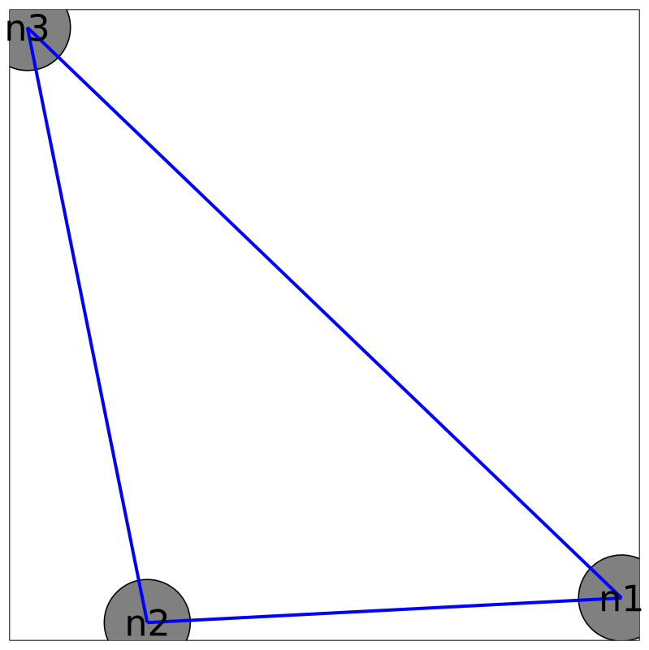

# PlasmoPlots

## Overview
`PlasmoPlots` provides specialized functions to plot `OptiGraph` optimization models from [Plasmo.jl](https://zavalab.github.io/Plasmo.jl).
The package uses [Plots.jl](https://github.com/JuliaPlots/Plots.jl) and consequently supports different plotting backends.  This package also uses the SFDP algorthm from [NetworkLayout.jl](https://github.com/JuliaGraphs/NetworkLayout.jl)
to visualize graph structures.

## Installation

```julia
pkg> add https://github.com/jalving/PlasmoPlots.jl.git
```

## Simple Examples

### Plotting a Simple OptiGraph

The following example shows how to plot a very simple optigraph containing 3 nodes and one hyperedge between them.
```julia
using Plasmo
using Plots, PlasmoPlots
gr()

#create an optigraph
graph = OptiGraph()

@optinode(graph1,n1)
@variable(n1, y >= 2)
@variable(n1,x >= 0)
@constraint(n1,x + y >= 3)
@objective(n1, Min, y)

@optinode(graph1,n2)
@variable(n2, y)
@variable(n2,x >= 0)
@constraint(n2,x + y >= 3)
@objective(n2, Min, y)

@optinode(graph1,n3)
@variable(n3, y )
@variable(n3,x >= 0)
@constraint(n3,x + y >= 3)
@objective(n3, Min, y)

@linkconstraint(graph1, n1[:x] + n2[:x] + n3[:x] == 3)

#plot the graph layout using `layout_plot`
plt_graph1 = layout_plot(graph1,
node_labels = true,
markersize = 60,
labelsize = 30,
linewidth = 4,
layout_options = Dict(:tol => 0.01,:iterations => 2));

#plot the matrix layout using `matrix_plot`
plt_matrix1 = matrix_plot(graph1,
node_labels = true,
markersize = 30);
```



<!--  -->

<!-- | ![][layout1-url]     | ![][matrix1-url]     | -->

### Plotting an OptiGraph with Subgraphs
This example builds up an optigraph that contains subgraphs and shows the resulting plot.
```julia
using Plasmo
using Plots, PlasmoPlots
gr()

#Create an optigraph containing subgraphs
graph1 = OptiGraph()

@optinode(graph1,n1)
@variable(n1, x >= 0)
@variable(n1, y >= 2)
@constraint(n1,x + y >= 3)
@objective(n1, Min, y)

@optinode(graph1,n2)
@variable(n2,x >= 0)
@variable(n2, y >= 2)
@constraint(n2,x + y >= 3)
@objective(n2, Min, y)

@optinode(graph1,n3)
@variable(n3,x >= 0)
@variable(n3, y >= 2)
@constraint(n3,x + y >= 3)
@objective(n3, Min, y)

@linkconstraint(graph1, n1[:x] + n2[:x] + n3[:x] == 3)

graph2 = OptiGraph()

@optinode(graph2,n4)
@variable(n4, x >= 0)
@variable(n4, y >= 2)
@constraint(n4,x + y >= 5)
@objective(n4, Min, y)

@optinode(graph2,n5)
@variable(n5, x >= 0)
@variable(n5, y >= 2)
@constraint(n5,x + y >= 5)
@objective(n5, Min, y)

@optinode(graph2,n6)
@variable(n6, x >= 0)
@variable(n6, y >= 2 )
@constraint(n6,x + y >= 5)
@objective(n6, Min, y)

@linkconstraint(graph2, n4[:x] + n5[:x] + n6[:x] == 5)

graph3 = OptiGraph()

@optinode(graph3,n7)
@variable(n7, x >= 0)
@variable(n7, y >= 2)
@constraint(n7,x + y >= 7)
@objective(n7, Min, y)

@optinode(graph3,n8)
@variable(n8, x >= 0)
@variable(n8, y >= 2)
@constraint(n8,x + y >= 7)
@objective(n8, Min, y)

@optinode(graph3,n9)
@variable(n9,x >= 0)
@variable(n9, y >= 2)
@constraint(n9,x + y >= 7)
@objective(n9, Min, y)

@linkconstraint(graph3, n7[:x] + n8[:x] + n9[:x] == 7)

#This is the high level optigraph that contains the other optigraphs
graph0 = OptiGraph()
@optinode(graph0,n0)
@variable(n0,x)
@constraint(n0,x >= 0)

add_subgraph!(graph0,graph1)
add_subgraph!(graph0,graph2)
add_subgraph!(graph0,graph3)
@linkconstraint(graph0,n3[:x] + n5[:x] + n7[:x] == 10)

@linkconstraint(graph0,n0[:x] + n3[:x] == 3)
@linkconstraint(graph0,n0[:x] + n5[:x] == 5)
@linkconstraint(graph0,n0[:x] + n7[:x] == 7)

#set the node labels which get plotted
for (i,node) in enumerate(all_nodes(graph0))
    node.label = "n$i"
end

#plot the graph layout using `layout_plot` which will show subgraphs
plt_graph2 = layout_plot(graph0,
node_labels = true,
markersize = 60,
labelsize = 30,
linewidth = 4,
subgraph_colors = true,
layout_options = Dict(:tol => 0.001,:C => 2, :K => 4, :iterations => 5));

#plot the matrix layout using `matrix_plot` which will show subgraphs
plt_matrix2 = matrix_plot(graph0,
node_labels = true,
subgraph_colors = true,
markersize = 16);
```
<!-- [layout1-url]: assets/simple_plot_layout.png =250x250 -->
[matrix1-url]: assets/simple_matrix_layout.png
